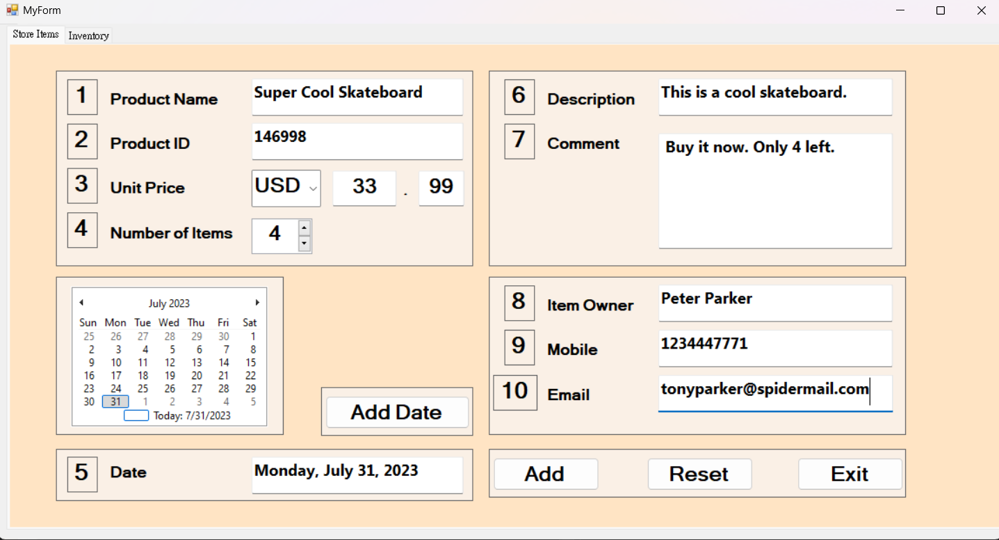
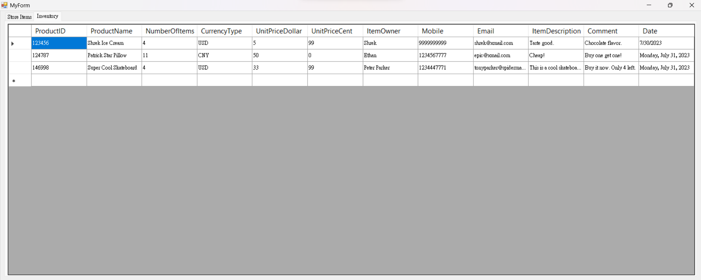
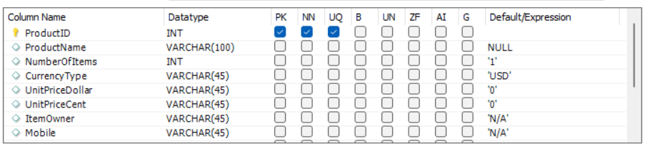

# Inventory Management System - C++/CLI with Visual Studio 2022 and MySQL Workbench

## An inventory management system.



&nbsp;

# Overview
Welcome to the Inventory Management System, a C++/CLI project developed in Visual Studio 2022, utilizing Windows Forms to create a user-friendly graphical user interface. The system is designed to efficiently manage inventory data using a MySQL database as the backend.

# Prerequisites
Before running the Inventory Management System, make sure you have the following components installed on your system:

1. [Visual Studio 2022](https://visualstudio.microsoft.com/downloads/).

2. [MySQL Installer](https://dev.mysql.com/downloads/installer/).

3. MySQL Server: Installed via MySQL Installer.

4. MySQL Workbench: Installed via MySQL Installer.

5. Connector/NET: Installed via MySQL Installer.

# Setting Up MySQL Database
1. After installing MySQL Server and MySQL Workbench, launch MySQL Workbench.

2. Connect to your local MySQL server instance using your username and password. Make sure to remember your MySQL username and password, as they will be used in the configuration file

3. Create a new schema named "inventorydb".

4. Create a data table named "inventorydb" to store inventory data. The table should have column headers listed in the images below.



# Configuration
1. Clone this repository to your local machine.

2. Create a new file named "config.ini" in the root directory of the project.

3. Open "config.ini" with a text editor and add the following content:
```
[Database]
Server=localhost
Username=your_mysql_username
Password=your_mysql_password
Database=inventorydb
```
4. Replace "your_mysql_username" and "your_mysql_password" with the credentials you used to set up MySQL.

5. Save the "config.ini" file.

# Running the Application
1. Open Visual Studio 2023.

2. Navigate to the root directory of the cloned project and open "MyForm.h" to access the Windows Forms GUI.

3. Before running the application, build the project to ensure there are no errors.

4. Once the build is successful, run the application using Visual Studio 2023.

5. The Inventory Management System GUI will appear, allowing you to manage your inventory with ease.

# Contributions
Contributions to this project are welcome! If you have any improvements or bug fixes, feel free to submit a pull request.

# License
This project is licensed under the MIT License.

# Disclaimer
The Inventory Management System is a personal project, and it is provided as-is, without any warranty. Use it at your own risk.